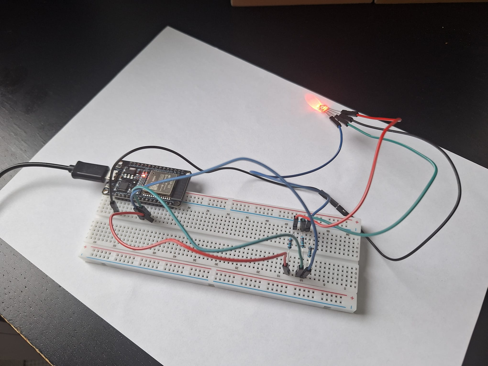

# 📡 HSL API combined with microcontroller 🚌

<table>
<tr>
<td></td>
<td></td>
</tr>
</table>


## 🌐 Overview

This microcontroller-based program fetches nearby public transport stops in Helsinki within a given **radius** based on **longitude** and **latitude**. An LED displays different colors based on arrival times for buses traveling to the specified **destination**.


| LED COLOR | Time to arrival |
|---|---|
| RED | < 2 minutes |
| BLUE | < 5 minutes |
| GREEN | >= 5 minutes |

## 🌟 Features

Setup parameters in cfg/config.py

 - **headsign**
 - **latitude**
 - **longitude**
 - **radius**
 - **wifi name**
 - **wifi password**

## ▶️ How to run

Setup parameters in cfg/config.py.

Find which tty USB is microcontrolles using. \
Replace `<nb>` with correct number
``` shell
ls /dev/ttyUSB*
chmod 666 /dev/ttyUSB<nb>
```

Erase everything from microcontroller
``` shell
esptool.py --port /dev/ttyUSB<nb> erase_flash
```

Flash microcontoller ESP-32
``` shell
esptool.py --baud 460800 write_flash 0x1000 ESP32_GENERIC-20250415-v1.25.0.bin
```

Copy program to the microcontoller
``` shell
./replace.sh
```

Run it by
``` shell
mpremote connect /dev/ttyUSB<nb> exec "exec(open('main.py').read())"
```

## 🛠️ Technical features

| Feature           | Detail                                                                                      |
|---------------------|--------------------------------------------------------------------------------------------------|
| HSL API          | Fetching data from HSL API using GraphQL queries  |
| Real-time data | Continuously polls HSL API for live arrival times  |
| LED auto-refresh  | Automatically updates LED color depending on fastest arrival time   |
| Config           | User must update configuration file regarding spatial data and Wifi information |
| Wifi   | Automatic connection to given Wifi network   |
| Debug Wifi | Reset network manually in case of problems by running reset_network.py|
| Errors      |   Descriptive errors shown depending on what happened  |

## 📦 Dependencies

- Mpremote
- Esptool
- Microcontroller firmaware: https://micropython.org/download/ESP32_GENERIC/

## 💡 Tips

Might have to run like this if esptool was installed by hand
``` shell
python3 -m esptool --port /dev/ttyUSB<nb> erase_flash
python3 -m esptool --baud 460800 write_flash 0x1000 ESP32_GENERIC-20250415-v1.25.0.bin
```

Any problems with wifi? It must be 2.4GHz. \
Still? Try running
``` shell
mpremote connect /dev/ttyUSB<nb> exec "exec(open('reset_network.py').read())"
```

### API
Register in digitransit to get api key. Build GraphQL query with help of their tool below:
https://portal-api.digitransit.fi/api-details#api=routing-v2-finland-gtfs

## 👥 Creators

- [Vladimir Lopatinski](https://github.com/vallucodes)
- [Matias Quero](https://github.com/kerito-cl)
- Saara-Leena Niemelä

